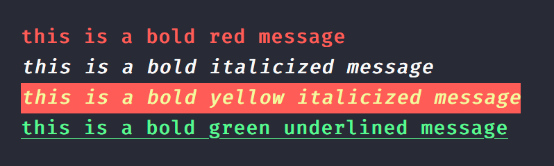
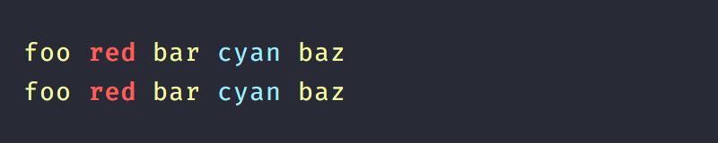

[](https://github.com/futagoza/colourant/actions?workflow=ci)
[](https://codecov.io/gh/futagoza/colourant)
[](https://www.npmjs.com/package/colourant)
[](https://david-dm.org/futagoza/colourant)
[](https://opensource.org/licenses/MIT)

> Node 8+ is required. Only LTS versions of Node are tested.

A Node.js library for formatting terminal text using ANSI

## features

* No dependencies
* Super [performant](#benchmarks)
* Supports [nested](#nested-methods) & [chained](#chained-methods) colours
* No `String.prototype` modifications
* Conditional [colour support](#conditional-support)
* Familiar [API](#api)
* Fully written in [TypeScript](#typescript)

## install

```
$ npm install --save colourant
```

## usage

```js
const { blue, bold, red, white } = require( "colourant" );

// basic usage
red( "red text" );

// chained methods
blue().bold().underline( "howdy partner" );

// nested methods
bold(`${ white().bgRed( "[ERROR]" ) } ${ red().italic( "Something happened" ) }`);
```

#### Chained Methods

```js
const { bold, green } = require( "colourant" );

console.log( bold().red( "this is a bold red message" ) );
console.log( bold().italic( "this is a bold italicized message" ) );
console.log( bold().yellow().bgRed().italic( "this is a bold yellow italicized message" ) );
console.log( green().bold().underline( "this is a bold green underlined message" ) );
```



#### Nested Methods

```js
const { cyan, red, yellow } = require( "colourant" );

console.log( yellow( `foo ${ red().bold( "red" ) } bar ${ cyan( "cyan" ) } baz` ) );
console.log( yellow( "foo " + red().bold( "red" ) + " bar " + cyan( "cyan" ) + " baz" ) );
```



#### Conditional Support

Toggle colour support as needed; `colourant` includes auto-detection, but may not cover all cases.

```js
const colourant = require( "colourant" );

// manually enable
colourant.enable();

// manually disable
colourant.disable();

// or use another library to detect support
colourant.enabled = require( "color-support" ).level;

console.log( colourant.red( "I will only be coloured red if `colourant.enabled` is true" ) );
```

## api

#### Built-in Styles

Built-in `colourant` styles return a `String` when invoked with input; otherwise chaining is expected.

> It's up to the developer to pass the output to destinations like `console.log`, `process.stdout.write`, etc.

The methods below are grouped by type for legibility purposes only. They each can be [chained](#chained-methods) or [nested](#nested-methods) with one another.

***Colours:***
> black &mdash; red &mdash; green &mdash; yellow &mdash; blue &mdash; magenta &mdash; cyan &mdash; white &mdash; gray &mdash; grey

***Backgrounds:***
> bgBlack &mdash; bgRed &mdash; bgGreen &mdash; bgYellow &mdash; bgBlue &mdash; bgMagenta &mdash; bgCyan &mdash; bgWhite

***Modifiers:***
> reset &mdash; bold &mdash; dim &mdash; italic* &mdash; underline &mdash; inverse &mdash; hidden &mdash; strikethrough*

<sup>* <em>Not widely supported</em></sup>

#### Utility Methods

As well as supporting the [kleur 3](https://github.com/lukeed/kleur) API, _colourant_ also provides:

```js
/*
    `codegroup` refer's to an array containing the start and end codes
    `codemap` refer's to a map of codegroups
*/

const colourant = require( "colourant" );

// Build a custom styled string transformer (stacked, alternative to chain)
colourant( ...codegroups )

// Build a non-chainable string transformer
colourant.from( number, number )
colourant.from( codegroup )

// Build a chainable string transformer
colourant.chain( codemap )

// Build and assign chainable string transformers
colourant.assign( target, codemap )

// Map of default styles
colourant.codes

// Build ANSI string for the given number
colourant.ANSI( number )

// Returns a grey string
colourant.time( string )

// Returns a white string
colourant.info( string )

// Returns a yellow string
colourant.warning( string )

// Returns a red string
colourant.error( string )

// Returns `true` if your env supports colouring by default (checked on library load)
colourant.supportsColour()
```

#### TypeScript

This library is written in [TypeScript](https://www.typescriptlang.org/), but I wanted to export the `colourant` function as a CommonJS default export (assigning it to Node's `module.exports`) so that it's usable via just calling `require( "colourant" )` instead of `require( "colourant" ).colourant` or `require( "colourant" ).default`; To import an exported interface or type, juse import the generated modules directly from `colourant/out`

## benchmarks

> Using Node v12.13.0 on a laptop powered by an AMD A10-4600M APU & 6GB RAM

#### Load time

```
chalk       :: 23.930ms
kleur       :: 11.131ms
ansi-colors ::  8.997ms
colorette   ::  3.244ms
colourant   ::  8.633ms
```

#### Performance

```
# All Colors
  ansi-colors  x  63,296 ops/sec ±1.93% (75 runs sampled)
  chalk        x 227,988 ops/sec ±1.32% (79 runs sampled)
  kleur        x 229,516 ops/sec ±1.67% (81 runs sampled)
  colorette    x 247,387 ops/sec ±3.44% (81 runs sampled)
  colourant    x 294,237 ops/sec ±1.50% (79 runs sampled)

# Stacked colors
  ansi-colors  x   7,408 ops/sec ±1.07% (80 runs sampled)
  chalk        x 174,681 ops/sec ±0.74% (83 runs sampled)
  kleur        x  26,174 ops/sec ±0.79% (82 runs sampled)
  colourant    x  90,674 ops/sec ±1.04% (81 runs sampled)

# Nested colors
  ansi-colors  x  18,684 ops/sec ±1.06% (81 runs sampled)
  chalk        x  42,756 ops/sec ±0.81% (83 runs sampled)
  kleur        x  62,920 ops/sec ±2.09% (84 runs sampled)
  colorette    x  87,270 ops/sec ±0.82% (82 runs sampled)
  colourant    x  61,707 ops/sec ±1.09% (77 runs sampled)
```

## credits

This project is based on [kleur 3](https://github.com/lukeed/kleur), and contains content originally from it:

- Some source code, like [`colourant/out/codes`](https://github.com/futagoza/colourant/blob/master/src/codes.ts)
- The [screenshots](https://github.com/futagoza/colourant/tree/master/screenshots) used in this README
- This README is a rewrite of [kleur's readme.md](https://github.com/lukeed/kleur/blob/master/readme.md)

## license

Copyright (c) 2019 [Futago-za Ryuu](http://github.com/futagoza)<br>
The MIT License, [http://opensource.org/licenses/MIT](http://opensource.org/licenses/MIT)
